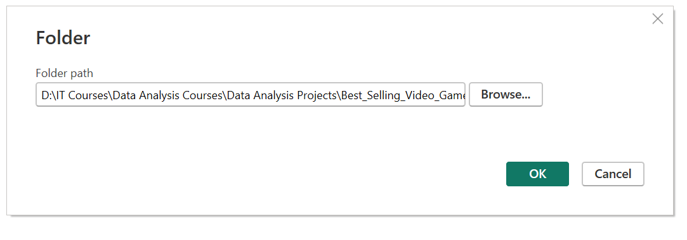
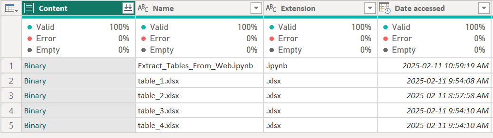
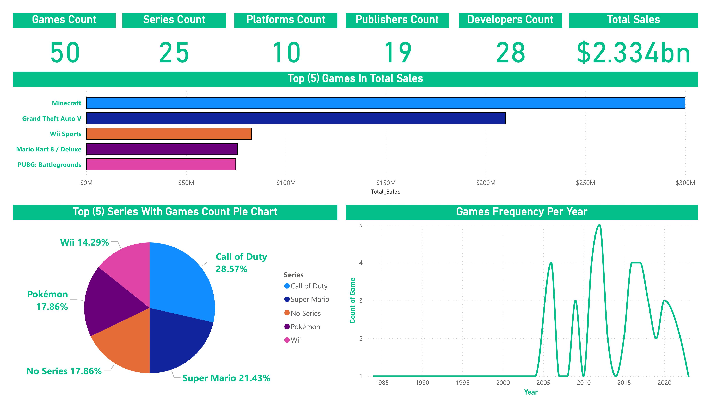
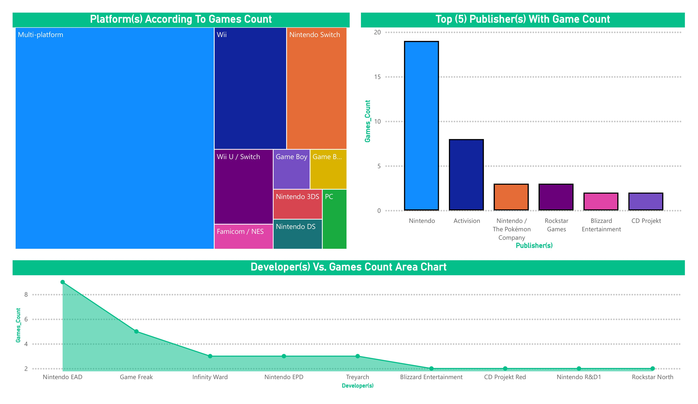

# **Best Selling Video Games Project:**


## **1. Introduction:**
This project analyzes the best-selling video games of all time, providing insights into the trends and titles that have dominated the gaming industry.  Using Python, data on the top 50 best-selling video games, spanning from 1984 to 2023, will be extracted from Wikipedia.  This data, representing global sales figures, will then be loaded into Power BI Desktop.  Within Power BI, the Extract, Transform, Load (ETL) process will be employed to clean, prepare, and structure the data, creating a robust foundation for analysis and reporting.  The resulting visualizations will offer a comprehensive overview of the best-selling games landscape, highlighting key performance indicators and potential patterns within this dynamic market.

You can see the full Dashboard from [here](Power_BI_Dashboard).

## **2. Tools I Used:**
To thoroughly explore insights and trends of the best-selling video games dataset I utilized the capabilities of a range of essential tools:

**1. Python:** for extract the tables of the dataset from the Wikipedia website.

**2. Power BI Desktop:** for Extract, Transform, Load (ETL) process and create interactive dashboards.

**3. Git & GitHub:** for sharing my analysis and dashboard.

## **3. Extract Tables From Web _Wikipedia_ (List of best-selling video games):**
Using Python Pandas library to extract tables from the Wikipedia website from link: https://en.wikipedia.org/wiki/List_of_best-selling_video_games

```py
import pandas as pd

url = "https://en.wikipedia.org/wiki/List_of_best-selling_video_games"

tables = pd.read_html(url)

print(f"The Number Of Tables = {len(tables)}")

for index, table in enumerate(tables):
    print(f"Saving Table_{index + 1}")
    file_name = f"table_{index + 1}.xlsx"
    table.to_excel(
        file_name,
        index=False,
    )
```
## **4. Upload Extracted Tables To Power BI Desktop:**

**4.1. Get data from Power BI using folder and choose _Excel_Files_Extraction_ folder:**


---
**4.2. Transform tables unto power query for cleaning and preparing structure the data:**

---
## **5. Claening & Preparing The Data In Power Query:**

**5.1. Use first row as headers.**

**5.2. Change type of column (sales) to fixced decimal number as it is currency column.**

**5.3. Remove duplicates if exists from remove rows.**

**5.4. Replace null values in series column into (No Series).**

**5.5. Replace ([c]) from initial relase date column to avoid errors when converting the column type from text to date.**

**5.6. Cahange the type of column initial relase date column from text to date data type.**

**5.7. Remove column (Ref.) references from the original site.**

**5.8. Change title column name into Game.**

**5.9. Change initial relase date column name into Release_Date.**

**5.10. Change Developer(s)[b]column name into Developer(s).**

**5.11. Change Publisher(s)[b]column name into Publisher(s).**

**5.12. Close and apply.**

## **6. Create Measures For Analysis & Visualization:**

**6.1. Create games count measure:**
```ml
Games_Count = DISTINCTCOUNT(Best_Selling_Video_Games[Game])
```
**6.2. Create platform count measure:**
```ml
Platforms_Count = DISTINCTCOUNT(Best_Selling_Video_Games[Platform(s)])
```

**6.3. Create publisher count measure:**
```ml
Publishers_Count = DISTINCTCOUNT(Best_Selling_Video_Games[Publisher(s)])
```

**6.4. Create developers count measure:**
```ml
Developers_Count = DISTINCTCOUNT(Best_Selling_Video_Games[Developer(s)])
```

**6.5. Create series count measure:**
```ml
Series_Count = DISTINCTCOUNT((Best_Selling_Video_Games[Series]))
```
**6.6. Create total sales measure:**
```ml
Total_Sales = SUM(Best_Selling_Video_Games[Sales])
```
## **7. Dashboards:**

**7.1. First Dashboard:**


---

**7.2. Second Dashboard:**



# **8. Analysis:**

- The total sales of the top 50 games amount to **$2.334 billion**, indicating a highly profitable market.

-  **Minecraft**, **Grand Theft Auto V**, **Wii Sports**, **Mario Kart 8/Deluxe**, and **PUBG: Battlegrounds** dominate the sales chart. **Minecraft** and **Grand Theft Auto V** stand out as the highest earners, reflecting their global popularity and longevity.

-  **Call of Duty**, **Pokemon**, **Super Mario**, and **Wii** are the top series. **Call of Duty** has the highest frequency (28.57%), indicating a strong franchise with multiple successful releases.

- The number of games released has increased significantly since the **1980s**, peaking around **2005–2020**. This trend reflects the growth of the gaming industry and the rise of new platforms and technologies.

- **Nintendo**, **Activision**, **The Pokemon Company**, **Rockstar Games**, and **Blizzard Entertainment** are the top publishers. **Nintendo** leads with the highest number of games, highlighting its strong presence in the industry.

- **Nintendo EPD**, **Game Freak**, **Infinity Ward**, and **Rockstar North** are among the top developers. **Nintendo EPD** has the highest number of games, reinforcing Nintendo's dominance in both publishing and development.

- **Nintendo** is a major player in both publishing and development, with multiple top-selling games and series like **Super Mario** and **Pokemon**.

- **Games** released on **multiple platforms** (e.g., **Minecraft**, **Grand Theft Auto V**) tend to achieve higher sales, indicating the importance of accessibility.

# **9. Recommendations:**

- **Developers** and **publishers** should prioritize releasing games on **multiple platforms** to maximize reach and sales.

- **Collaborating** with or learning from **Nintendo's successful strategies** could benefit other companies in the industry.

- **Keeping** an eye on **emerging platforms** and technologies (**cloud gaming**, **VR**) can help companies stay competitive.

